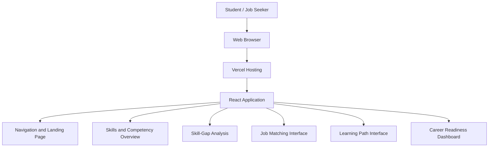

# SkillMap AI 🚀
### Know Your Skills. Discover Your Gaps. Get Job Ready.

SkillMap AI is a career-readiness web application designed to help students and job seekers understand their skills, identify areas for improvement, explore relevant job opportunities, and plan their learning journey toward their desired careers.

## 🌐 Live Demo

**Deployment Link:** https://skill-bridge-demo-rho.vercel.app

Open the live website to explore the SkillMap AI interface and test its available features.

> Note: If the website requests Vercel authentication, the deployment may be protected. Configure public access for the production deployment if you want others to test it without logging in.

## 🎯 Problem Statement

Students and job seekers often struggle to understand the skills required for their desired careers. They may find it difficult to identify skill gaps, select relevant learning topics, and determine which job opportunities align with their current competencies.

SkillMap AI aims to simplify this process by bringing skill assessment, skill-gap identification, job exploration, and learning-path guidance together in one platform.

## 👥 Target Users

- College students preparing for internships and placements.
- Fresh graduates exploring entry-level job opportunities.
- Job seekers looking to improve their professional skills.
- Learners who want a structured approach to career preparation.

## 🏗️ Architecture Diagram

The following diagram represents the current frontend deployment architecture.



### Architecture Explanation

1. **User:** Students and job seekers access the application through a web browser.
2. **Vercel:** Hosts the deployed frontend and makes the website accessible through a public URL when deployment protection is disabled.
3. **React Application:** Renders the interface using reusable components.
4. **Interface Components:** Organize the application's skills overview, skill-gap analysis, job-matching interface, learning paths, and dashboard.

**Architecture scope:** This diagram describes the frontend and hosting structure. A backend, database, or AI service is not represented unless it has been implemented and integrated.

## 🛠️ Technologies Used

- **React** — Component-based user interface development.
- **JavaScript (JSX)** — Frontend logic and component structure.
- **Vite** — Development server and production build tool.
- **HTML5** — Web page structure.
- **CSS3** — Styling and responsive interface design.
- **Git and GitHub** — Version control and source-code management.
- **Vercel** — Frontend deployment and hosting.

## ✨ Main Features and Interface Sections

- Career-readiness landing page.
- Skills and competency overview.
- Skill-gap analysis interface.
- Job-matching or job-search interface.
- Learning-path presentation.
- Career-readiness dashboard.
- Reusable UI components and navigation.

The functionality available to users depends on the features implemented in the current version.

## 🧪 How to Test the Deployment

1. Open the [SkillMap AI Live Demo](https://skill-bridge-demo-rho.vercel.app).
2. Verify that the landing page loads correctly.
3. Explore the navigation menu and available sections.
4. Test the visible buttons and interface interactions.
5. Check the skills, job-matching, skill-gap, and learning-path sections, where available.
6. Report any broken links, non-functional controls, or layout issues.

Please do not enter sensitive personal information unless secure data handling has been implemented.

## 💻 Run the Project Locally

### Prerequisites

- Node.js
- npm
- Git

### Installation

Clone the repository:

```bash
git clone https://github.com/Preethi22-06/Skill-Bridge-demo.git
```

Navigate to the project directory:

```bash
cd Skill-Bridge-demo
```

Install dependencies:

```bash
npm install
```

Start the development server:

```bash
npm run dev
```

Open the local URL displayed in the terminal, usually `http://localhost:5173`.

### Production Build

To generate a production build, run:

```bash
npm run build
```

The generated files will be available in the `dist` directory.

## 🌍 Real-World Impact

SkillMap AI aims to make career preparation more structured and accessible. By bringing skills, potential gaps, job exploration, and learning guidance into one interface, the platform can help learners:

- Recognize skills they may need to improve.
- Prioritize relevant learning activities.
- Explore career opportunities aligned with their competencies.
- Organize their career-preparation journey.
- Prepare more systematically for internships and placements.

The long-term goal is to help learners move from their current skill set toward the competencies expected in their desired careers.

## 📌 Project Status

The frontend is deployed on Vercel. The availability of automated skill analysis, live job matching, personalized recommendations, authentication, and data persistence depends on the backend services and integrations implemented in the project.

## 📂 Source Code

**GitHub Repository:**  
https://github.com/Preethi22-06/Skill-Bridge-demo

---

**Developed as a career-readiness project to help learners understand their skills, discover improvement areas, and work toward their career goals.**
